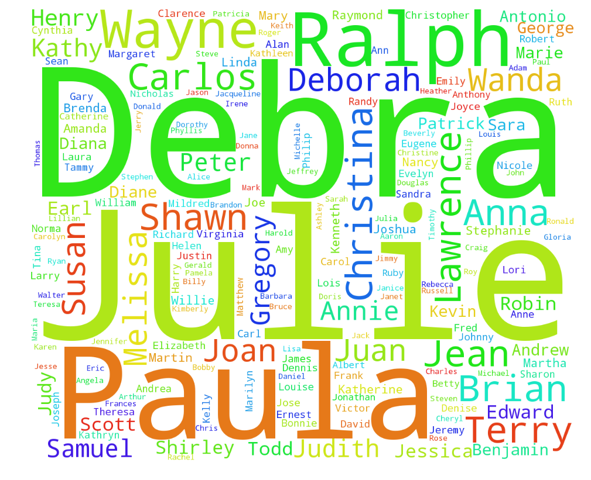

# Plot Review - pgm293

The first question I have about the plot is: what is it plotting? A title or description would be helpful here. Something to lead me in understanding what insight I should glean from it. The challenge with word clouds in particular is that the sizes of the words do not necessarily clearly represent the variance in data. For example, is the name Debra really so much larger than Gregory? A peak at the data reveals that Debra appears 16 times, Gregory 8. Yet, in the plot, Debra's name looks much larger than twice as big as Gregory. So another improvement would be to represent scale in a consistent and clearer way. Another criticism of word clouds is that there is too much visual noise to make much sense of what you're seeing. It's hard for me to tell you the range of sizes beyond the first few very large words. Taking a word at random, I don't know where it fits in the range of frequencies. This is where color might be helpful. Obviously, this was a fun assignment to mess around with data, but there are many [criticisms of word clouds](http://www.niemanlab.org/2011/10/word-clouds-considered-harmful/), including from the previous Senior Software Architect at the New York Times. 
