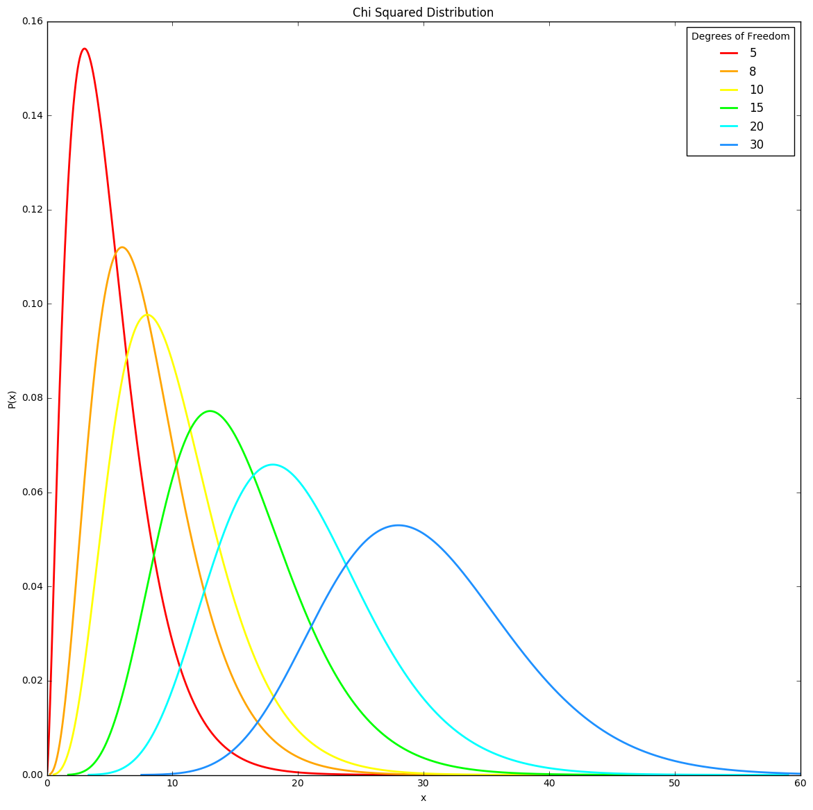

# Plot Review - xz1809

This is a classic plot of a straightforward breakdown of the chi-square distribution. It's nicely labeled, with a good legend and title. The colors work well to differentiate the different Degrees of Freedom. Since it is a good plot, there are only incremental improvements that could be made. Perhaps a slightly darker background, with a light grid, might give more structure to the visualization, allowing a viewer to get a better sense of the median of each distribution. The lines might also be made somewhat thicker, as the lighter colors, particularly the yellow, get lost in the background a bit. Another idea to provide some more information in the plot might be to plot another bit of data on another y-axis that tells us more about chi-square distributions and how they change with different degrees of freedom. For example, you could plot the mean, median, or standard deviation of each Degree of Freedom as a line alongside the distributions.
