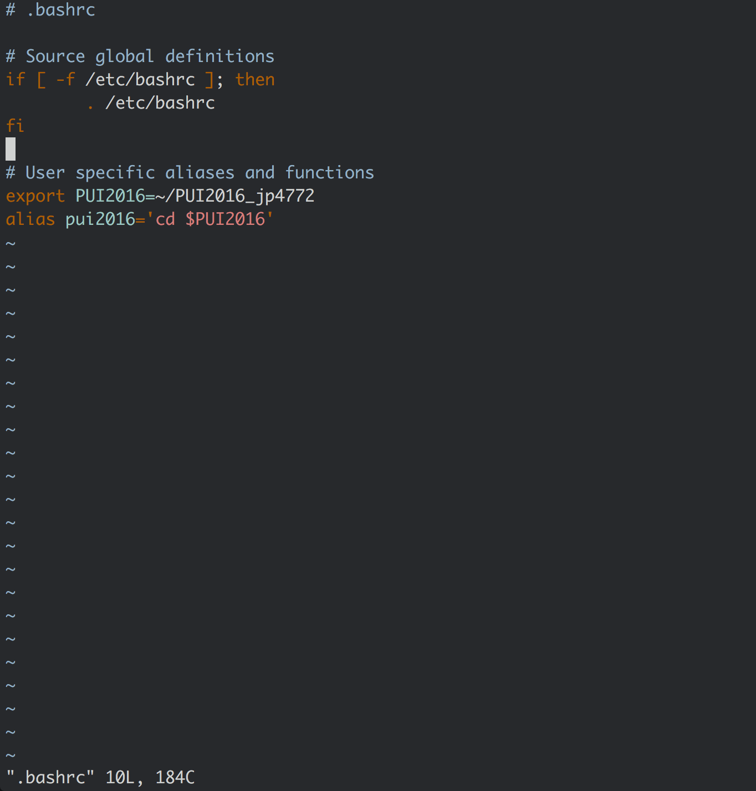
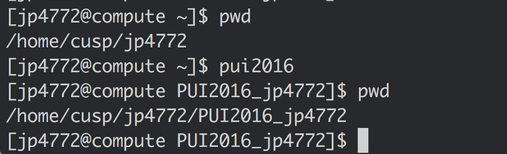

# HW1 PUI2016

*Initial Tangent*: To begin, I was having trouble SSHing into compute from gw. Turns out there was an issue with my version of OpenSSH on my Mac. A quick `brew install openssh`, though, took care of things. So, for reference, if a future student runs into issues with the vague `ssh_exchange_identification: Connection closed by remote host` error, have them upgrade OpenSSH and try again.

Now that I could log in to compute, I promptly got to work.

1. First, I created the directory `PUI2016_jp4772` in my home directory with the trusty `mkdir` command. Hasn't failed me yet.

2. Next, I opened up my `.bashrc` file with vim (Vim guy here), and added a few key lines:


3. To test that my ENV variables and alias were working correctly, I spun up a new terminal (did not remember how to load new settings without a new window). Then, with great anticipation, I typed the three lines:
```
pwd
pui2016
pwd
```
This emerged:


All was well with the world.


